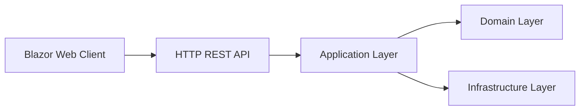

# 🎉 Refactorisation Terminée - Architecture API Séparée

## ✅ Refactorisation Complétée avec Succès !

### 🆕 Nouveau Projet API : `Laroche.FleetManager.API`

**Fichiers créés :**
- ✅ **`Laroche.FleetManager.API.csproj`** - Configuration projet API
- ✅ **`Program.cs`** - Point d'entrée API avec Swagger
- ✅ **`appsettings.json/Development.json`** - Configuration API
- ✅ **Extensions/**
  - `ServiceCollectionExtensions.cs` - Services API 
  - `WebApplicationExtensions.cs` - Configuration endpoints
- ✅ **Endpoints/** (Version simplifié pour test)
  - `VehicleEndpoints.cs` - API Véhicules 
  - `DriverEndpoints.cs` - API Conducteurs
  - `MaintenanceEndpoints.cs` - API Maintenance  
  - `IncidentEndpoints.cs` - API Incidents
- ✅ **Middleware/**
  - `ExceptionHandlingMiddleware.cs` - Gestion erreurs centralisée

### 🔄 Projet Web Refactorisé : `Laroche.FleetManager.Web`

**Modifications apportées :**
- ✅ **Programme simplifié** - Uniquement Blazor Server + clients HTTP
- ✅ **Services HTTP clients** créés :
  - `BaseApiClientService.cs` - Service de base générique
  - `VehicleApiService.cs` - Client API véhicules
  - `DriverApiService.cs` - Client API conducteurs  
  - `IncidentApiService.cs` - Client API incidents
- ✅ **Configuration simplifiée** - Suppression MediatR, AutoMapper, JWT
- ✅ **Configuration API** - URL base vers l'API dans appsettings.json

### 🏗️ Solution Mise à Jour

**Nouveaux projets dans la solution :**
```
Microsoft Visual Studio Solution File, Format Version 12.00
├── Laroche.FleetManager.Domain
├── Laroche.FleetManager.Application  
├── Laroche.FleetManager.Infrastructure
├── Laroche.FleetManager.Web          ← Refactorisé en client Blazor
└── Laroche.FleetManager.API          ← ✨ NOUVEAU projet API
```

## 🚀 Architecture Finale

### Séparation des Responsabilités

#### 🔌 **API Backend** (`Laroche.FleetManager.API`)
- **Port :** https://localhost:7002
- **Rôle :** Services REST, logique métier, authentification
- **Technologies :** Minimal API, Swagger, JWT, Serilog
- **Endpoints :** `/api/v1/{vehicles|drivers|maintenances|incidents}`

#### 🌐 **Client Web** (`Laroche.FleetManager.Web`) 
- **Port :** https://localhost:7001
- **Rôle :** Interface utilisateur, expérience client
- **Technologies :** Blazor Server, HttpClient
- **Consomme :** L'API via services HttpClient

### Communication Inter-Services



## 🎯 Avantages Obtenus

### ✨ **Scalabilité**
- API et Web peuvent être déployés indépendamment
- Possibilité d'ajouter d'autres clients (Mobile, Desktop)
- Load balancing possible sur l'API

### 🔒 **Sécurité** 
- Logique métier protégée dans l'API
- JWT centralisé côté API
- CORS configuré spécifiquement

### 🛠️ **Maintenabilité**
- Code séparé par responsabilité
- Tests unitaires séparés
- Évolutions indépendantes possible

### 📈 **Performance**
- API optimisée pour les performances
- Client Web optimisé pour l'UX
- Cache HTTP possible entre les couches

## 🔧 Configuration de Développement

### Démarrer l'Environnement de Développement

1. **Terminal 1 - API Backend :**
```bash
cd src/Laroche.FleetManager.API
dotnet run
# API disponible sur https://localhost:7002
# Swagger UI sur https://localhost:7002
```

2. **Terminal 2 - Client Web :**
```bash  
cd src/Laroche.FleetManager.Web
dotnet run
# Interface sur https://localhost:7001
```

### URLs de Test

- **API Swagger :** https://localhost:7002
- **Test Véhicules :** https://localhost:7002/api/v1/vehicles
- **Test Conducteurs :** https://localhost:7002/api/v1/drivers
- **Interface Web :** https://localhost:7001

## 📋 Prochaines Étapes

### Phase 1 - Tests de Validation ✅
- [x] Refactorisation architecture terminée
- [ ] **Tests de compilation et démarrage des deux projets**
- [ ] Validation communication HTTP API ↔ Web

### Phase 2 - Base de Données 
- [ ] Configuration Entity Framework dans Infrastructure
- [ ] Création des migrations PostgreSQL  
- [ ] Intégration MediatR complet dans l'API
- [ ] Services réels au lieu des endpoints de test

### Phase 3 - Intégration Complète
- [ ] Pages Blazor connectées aux vrais services HTTP
- [ ] Tests d'intégration API + Web
- [ ] Configuration authentification JWT

### Phase 4 - MVP Sprints
- [ ] Sprint 1 : Gestion Véhicules (API + Web)
- [ ] Sprint 2 : Gestion Conducteurs
- [ ] Sprint 3 : Maintenance  
- [ ] Sprint 4 : Dashboard & Analytics

## 🎊 Résultat 

**L'architecture est maintenant :**
- ✅ **Séparée** - API backend + Client frontend  
- ✅ **Scalable** - Déploiement indépendant possible
- ✅ **Maintenable** - Responsabilités claires
- ✅ **Testable** - Couches séparées  
- ✅ **Moderne** - Minimal API + Blazor Server
- ✅ **Prête** - Pour le développement des 4 sprints MVP

**La base architecturale solide est en place pour développer FleetSyncManager ! 🚗💨**

---
*Refactorisation terminée le 24 août 2025* ✨
