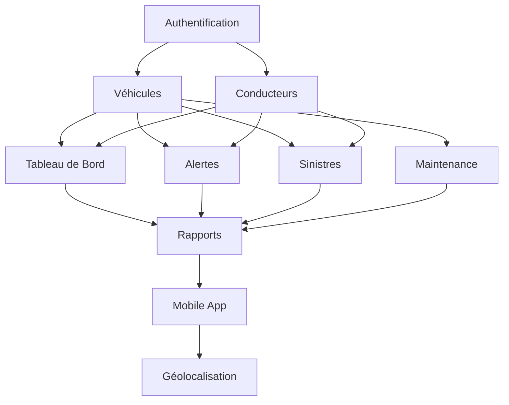

# Priorisation des Fonctionnalités MVP

## Matrice de Scoring (échelle 1-5)

### Critères d'Évaluation
- **Impact Utilisateur (IU) :** Combien d'utilisateurs bénéficient de cette fonctionnalité ?
- **Alignement Stratégique (AS) :** Correspond aux objectifs métier principaux ?
- **Faisabilité Technique (FT) :** Complexité de développement (5 = facile, 1 = complexe)
- **Ressources Requises (RR) :** Effort de développement (5 = léger, 1 = lourd)
- **Niveau de Risque (NR) :** Risques techniques et métier (5 = faible, 1 = élevé)

### Formule de Priorité
**Score = (Impact Utilisateur × Alignement Stratégique × Faisabilité Technique) / (Ressources Requises × Niveau de Risque)**

## Analyse Détaillée par Fonctionnalité

### 🔴 FONCTIONNALITÉS CRITIQUES (Version 1.0 - MVP Core)

#### 1. Système d'Authentification et Rôles
| Critère | Score | Justification |
|---------|-------|--------------|
| Impact Utilisateur | 5 | Tous les utilisateurs concernés |
| Alignement Stratégique | 5 | Fondamental pour la sécurité |
| Faisabilité Technique | 4 | Technologies standards (.NET Identity) |
| Ressources Requises | 4 | Développement modéré (3-5 jours) |
| Niveau de Risque | 4 | Risques sécurité maîtrisables |

**Score Final : (5×5×4)/(4×4) = 100/16 = 6.25**

**Status :** 🔴 CRITIQUE - Version 1.0
**Dépendances :** Aucune (fondation)

#### 2. Gestion des Véhicules (CRUD complet)
| Critère | Score | Justification |
|---------|-------|--------------|
| Impact Utilisateur | 5 | Cœur métier - tous utilisateurs |
| Alignement Stratégique | 5 | Objectif principal de l'application |
| Faisabilité Technique | 4 | CRUD classique avec Entity Framework |
| Ressources Requises | 3 | Développement conséquent (8-10 jours) |
| Niveau de Risque | 4 | Risques techniques limités |

**Score Final : (5×5×4)/(3×4) = 100/12 = 8.33**

**Status :** 🔴 CRITIQUE - Version 1.0
**Dépendances :** Authentification

#### 3. Gestion des Conducteurs (CRUD complet)
| Critère | Score | Justification |
|---------|-------|--------------|
| Impact Utilisateur | 5 | Gestionnaires et conducteurs |
| Alignement Stratégique | 5 | Ressource humaine essentielle |
| Faisabilité Technique | 4 | Similar au module véhicules |
| Ressources Requises | 3 | Développement conséquent (6-8 jours) |
| Niveau de Risque | 4 | Pattern établi |

**Score Final : (5×5×4)/(3×4) = 100/12 = 8.33**

**Status :** 🔴 CRITIQUE - Version 1.0
**Dépendances :** Authentification

#### 4. Tableau de Bord Principal
| Critère | Score | Justification |
|---------|-------|--------------|
| Impact Utilisateur | 4 | Vision globale pour gestionnaires |
| Alignement Stratégique | 4 | Interface principale |
| Faisabilité Technique | 3 | Agrégations et graphiques |
| Ressources Requises | 3 | Développement modéré (5-6 jours) |
| Niveau de Risque | 4 | Complexité modérée |

**Score Final : (4×4×3)/(3×4) = 48/12 = 4.00**

**Status :** 🔴 CRITIQUE - Version 1.0
**Dépendances :** Véhicules, Conducteurs

#### 5. Système d'Alertes de Base (Email)
| Critère | Score | Justification |
|---------|-------|--------------|
| Impact Utilisateur | 4 | Prévention des oublis critiques |
| Alignement Stratégique | 4 | Automatisation souhaitée |
| Faisabilité Technique | 3 | Service email + scheduler |
| Ressources Requises | 3 | Développement modéré (4-5 jours) |
| Niveau de Risque | 3 | Dépendance services externes |

**Score Final : (4×4×3)/(3×3) = 48/9 = 5.33**

**Status :** 🔴 CRITIQUE - Version 1.0
**Dépendances :** Véhicules, Configuration SMTP

### 🟡 FONCTIONNALITÉS IMPORTANTES (Version 1.1 - MVP Extended)

#### 6. Gestion des Sinistres
| Critère | Score | Justification |
|---------|-------|--------------|
| Impact Utilisateur | 4 | Conducteurs et gestionnaires |
| Alignement Stratégique | 4 | Conformité et traçabilité |
| Faisabilité Technique | 3 | Upload fichiers, workflow |
| Ressources Requises | 2 | Développement complexe (8-10 jours) |
| Niveau de Risque | 3 | Gestion des fichiers, workflow |

**Score Final : (4×4×3)/(2×3) = 48/6 = 8.00**

**Status :** 🟡 IMPORTANT - Version 1.1
**Dépendances :** Véhicules, Conducteurs, Storage

#### 7. Suivi Maintenance Avancé
| Critère | Score | Justification |
|---------|-------|--------------|
| Impact Utilisateur | 3 | Principalement gestionnaires |
| Alignement Stratégique | 4 | Optimisation des coûts |
| Faisabilité Technique | 3 | Planification, calendrier |
| Ressources Requises | 2 | Interface calendrier complexe (6-8 jours) |
| Niveau de Risque | 3 | Logique métier complexe |

**Score Final : (3×4×3)/(2×3) = 36/6 = 6.00**

**Status :** 🟡 IMPORTANT - Version 1.1
**Dépendances :** Véhicules, Alertes

#### 8. Rapports Prédéfinis et Export
| Critère | Score | Justification |
|---------|-------|--------------|
| Impact Utilisateur | 3 | Gestionnaires et admin |
| Alignement Stratégique | 3 | Aide à la décision |
| Faisabilité Technique | 4 | Bibliothèques de reporting existantes |
| Ressources Requises | 3 | Développement modéré (4-5 jours) |
| Niveau de Risque | 4 | Technologies éprouvées |

**Score Final : (3×3×4)/(3×4) = 36/12 = 3.00**

**Status :** 🟡 IMPORTANT - Version 1.1
**Dépendances :** Toutes les données métier

### 🟢 FONCTIONNALITÉS SOUHAITÉES (Version 2.0+)

#### 9. Application Mobile
| Critère | Score | Justification |
|---------|-------|--------------|
| Impact Utilisateur | 4 | Conducteurs en mobilité |
| Alignement Stratégique | 3 | Amélioration UX |
| Faisabilité Technique | 2 | Développement mobile supplémentaire |
| Ressources Requises | 1 | Ressources importantes (15-20 jours) |
| Niveau de Risque | 2 | Technologies différentes |

**Score Final : (4×3×2)/(1×2) = 24/2 = 12.00**

**Status :** 🟢 SOUHAITÉ - Version 2.0
**Dépendances :** API REST complète

#### 10. Géolocalisation GPS
| Critère | Score | Justification |
|---------|-------|--------------|
| Impact Utilisateur | 3 | Suivi temps réel |
| Alignement Stratégique | 3 | Fonctionnalité avancée |
| Faisabilité Technique | 2 | Intégration GPS, cartes |
| Ressources Requises | 1 | Développement complexe (12-15 jours) |
| Niveau de Risque | 2 | Dépendances services tiers |

**Score Final : (3×3×2)/(1×2) = 18/2 = 9.00**

**Status :** 🟢 SOUHAITÉ - Version 2.0
**Dépendances :** Application mobile, Services géolocalisation

## Roadmap de Développement

### Phase 1 - MVP Core (Version 1.0) - 6-8 semaines
**Objectif :** Application fonctionnelle avec les bases essentielles

1. **Semaine 1-2 :** Setup + Authentification
   - Configuration projet .NET + PostgreSQL
   - Système d'authentification et rôles
   - Architecture de base

2. **Semaine 3-4 :** Modules Métier Core
   - Gestion des véhicules (CRUD complet)
   - Gestion des conducteurs (CRUD complet)
   - Base de données et migrations

3. **Semaine 5-6 :** Interface et Intégration
   - Tableau de bord principal
   - Navigation et UX
   - Système d'alertes email basique

4. **Semaine 7-8 :** Tests et Déploiement
   - Tests unitaires et intégration
   - Documentation utilisateur
   - Déploiement environnement de test

### Phase 2 - MVP Extended (Version 1.1) - 4-6 semaines
**Objectif :** Fonctionnalités avancées et optimisations

1. **Semaine 9-10 :** Gestion des Sinistres
   - Module de déclaration
   - Workflow de suivi
   - Gestion des documents

2. **Semaine 11-12 :** Maintenance Avancée
   - Planification et calendrier
   - Historique détaillé
   - Alertes intelligentes

3. **Semaine 13-14 :** Rapports et Analytics
   - Rapports prédéfinis
   - Exports Excel/PDF
   - Optimisations performance

### Phase 3 - Version 2.0+ (Version Future) - 8-12 semaines
**Objectif :** Innovation et expérience utilisateur

1. **Application Mobile :** Interface dédiée conducteurs
2. **Géolocalisation :** Suivi GPS temps réel
3. **BI Avancée :** Tableaux de bord intelligents
4. **Intégrations :** API externes, IoT véhicules

## Dependencies Map

## Récapitulatif des Priorités

| Rang | Fonctionnalité | Score | Version | Effort | Status |
|------|----------------|-------|---------|--------|--------|
| 1 | Gestion Véhicules | 8.33 | 1.0 | 8-10j | 🔴 CRITIQUE |
| 2 | Gestion Conducteurs | 8.33 | 1.0 | 6-8j | 🔴 CRITIQUE |
| 3 | Gestion Sinistres | 8.00 | 1.1 | 8-10j | 🟡 IMPORTANT |
| 4 | Authentification | 6.25 | 1.0 | 3-5j | 🔴 CRITIQUE |
| 5 | Maintenance Avancée | 6.00 | 1.1 | 6-8j | 🟡 IMPORTANT |
| 6 | Alertes Email | 5.33 | 1.0 | 4-5j | 🔴 CRITIQUE |
| 7 | Tableau de Bord | 4.00 | 1.0 | 5-6j | 🔴 CRITIQUE |
| 8 | Rapports | 3.00 | 1.1 | 4-5j | 🟡 IMPORTANT |
| 9 | Application Mobile | 12.00 | 2.0 | 15-20j | 🟢 SOUHAITÉ |
| 10 | Géolocalisation | 9.00 | 2.0 | 12-15j | 🟢 SOUHAITÉ |

Cette priorisation guide le développement en se concentrant sur la valeur métier maximale avec les ressources disponibles.
